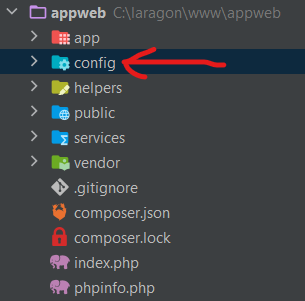
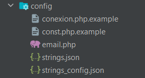
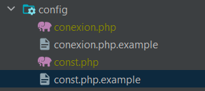
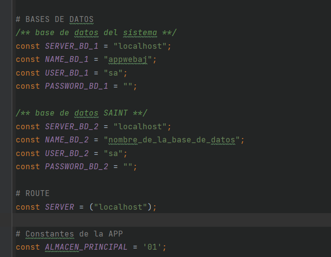

# APPWEB (Logistica y despacho)

***

### Requisitos
> Apache 2.4
>
> Php 7.4 (minimo)
> 
> MS SQL Server 2012

***
#### Los instaladores se encuentran en la carpeta ` instalers `
#### los archivos ` .dll ` son para la conexion con Sql Server (hay agregarlos al php 7.4)
***

## importante !!

### cuando recien descargue el proyecto abra el directorio config

### encontraras los archivos conexion y const

### copielos y peguelos en la misma carpeta eliminando la extencion ` .example `

### ingrese al fichero ` const.php ` y cambie los parametros

*** 

Desarrollado por INTEC C.A.

